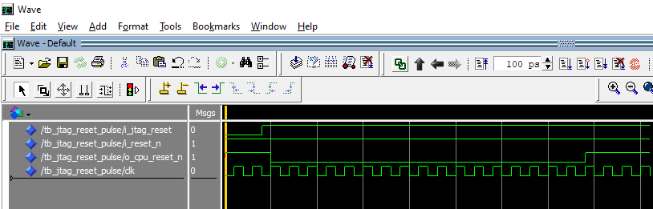
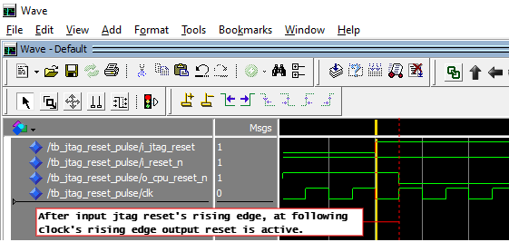
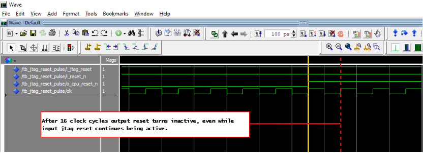
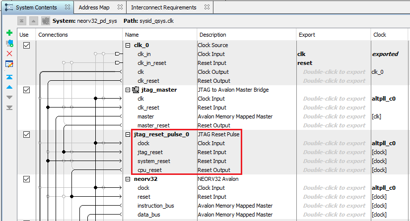

# jtag_reset_pulse — Design Notes

Custom Platform Designer IP that generates a bounded CPU reset pulse on each
rising edge of the Intel JTAG Avalon Master Bridge `debug_reset_request` signal.
Used in 2/3 of RISC-V example systems, with SERV and neorv32 cores, for this project to solve a firmware loading problem. It did not need to be used with a system including the VexRiscv core.

---

## 1. Problem

When a system-console TCL script calls `close_service master $master` after
loading firmware, the Intel JTAG Avalon Master Bridge has been observed to assert
its `debug_reset_request` (conduit) output and **hold it HIGH** while the bridge
hardware reinitialises. If this signal is wired directly to the CPU reset input,
the CPU remains permanently in reset for the remainder of the JTAG session. The
only recovery is a physical board reset.

The same behaviour has been observed when opening a JTAG service: the bridge
appears to assert `debug_reset_request` at connect time, which would immediately
reset the CPU before any firmware loading takes place.

---

## 2. Solution

Edge-detect the rising edge of `debug_reset_request` and generate a bounded
reset pulse of `PULSE_LEN` clock cycles. Once the pulse expires, a sustained
HIGH on `i_jtag_reset` has no further effect — only a new rising edge triggers
another pulse.

This gives the CPU exactly one clean, time-bounded reset per JTAG connect or
firmware load, without permanently holding it in reset when the bridge
reinitialization keeps the signal asserted.

---

## 3. Timing Diagram



- **Detection latency**: 1 clock cycle (registered `jtag_prev`).
- **Pulse width**: `PULSE_LEN + 1` clock cycles from detection edge
  (16 countdown cycles + the initial set cycle = 17 cycles total at 50 MHz ≈ 340 ns).
- **Sustained assertion**: after the pulse expires, a continuously-held HIGH on
  `i_jtag_reset` is ignored until a new rising edge occurs.
- **Physical reset**: `o_cpu_reset_n <= i_reset_n and jtag_reset_n` — the
  physical button overrides independently of the JTAG pulse.

**Simulation waveforms (QuestaSim FSE):**

Rising edge detection — 1-cycle latency to output:



Pulse expiry after 16 cycles — `i_jtag_reset` remains high but output deasserts:



---

## 4. Interface

### Ports

| Port | Direction | Description |
| --- | --- | --- |
| `clk` | in | System clock |
| `i_reset_n` | in | Physical reset, active-low (pre-synchronized at top level) |
| `i_jtag_reset` | in | JTAG Avalon Master Bridge `debug_reset_request`, active-high |
| `o_cpu_reset_n` | out | CPU reset output, active-low |

### Platform Designer Interfaces (hw.tcl)

| PD Interface | Type | Connects to |
| --- | --- | --- |
| `clock` | clock sink | System clock (`clk_0.clk`) |
| `reset_sys` | reset sink | Physical reset path (`clk_0.clk_reset`) |
| `reset_jtag` | reset sink | JTAG Master Bridge (`jtag_master.master_reset`) |
| `reset_cpu` | reset source | CPU reset input (`cpu.reset` or equivalent) |

> **Note:** The two Quartus workspace systems (SERV, neorv32) use local copies
> of this IP with slightly different PD interface names in their respective
> `jtag_reset_pulse_hw.tcl` files. The canonical `hw.tcl` in this directory
> uses the interface names listed above.

---

## 5. Integration into a New System

1. Add `HW/lib/IPs/` to the Platform Designer IP search path:
   **Platform Designer → Tools → Options → IP Search Path**.
2. Instantiate `JTAG Reset Pulse` from the IP catalog.
3. Connect:
   - `clock.clk_in` ← system clock
   - `reset_sys` ← clock conduit reset (physical reset path)
   - `reset_jtag` ← `jtag_master.master_reset`
   - `reset_cpu` → CPU reset input
4. Disconnect the old direct `jtag_master.master_reset → cpu.reset` wire.

**Example — neorv32 system (Platform Designer System Contents view):**



---

## 6. Simulation

Tests are in `tb/tb_jtag_reset_pulse.vhd` and run with VUnit. Both simulators
below are verified pass 5 of 5.

**GHDL — WSL (Linux):**

```bash
sudo apt install ghdl          # one-time install
VUNIT_SIMULATOR=ghdl python3 HW/sim/run.py
```

**Questa FSE — Windows native (PowerShell):**

Questa FSE is bundled with Quartus 25.1. Run from a native Windows shell;
it does not work when invoked from WSL (path-translation incompatibility).

```powershell
$env:PATH = "C:\altera_lite\25.1std\questa_fse\win64;" + $env:PATH
$env:VUNIT_SIMULATOR = "modelsim"
python HW\sim\run.py
```

### Test Cases

| Test | Stimulus | Assertion |
| --- | --- | --- |
| `idle_no_reset` | No resets asserted | `o_cpu_reset_n = '1'` after 5 cycles |
| `physical_reset` | `i_reset_n = '0'` | `o_cpu_reset_n = '0'` immediately |
| `jtag_rising_edge_starts_pulse` | Rising edge on `i_jtag_reset` | `o_cpu_reset_n = '0'` within 2 cycles |
| `jtag_sustained_no_repeat` | `i_jtag_reset` held high 20+ cycles | `o_cpu_reset_n = '1'` after `PULSE_LEN + 5` cycles |
| `jtag_second_edge_retriggers` | Two separate rising edges | Second edge produces second pulse |
